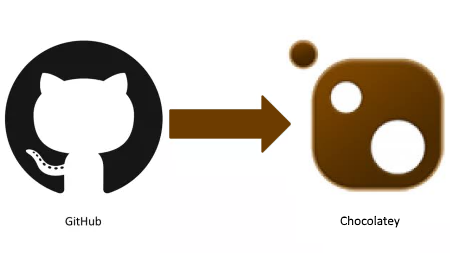

# ChocolateyCoolWhip    

ChocolateyCoolWhip is a simple to install NuGet package that helps configure continuous integration and deployment of [Chocolatey](http://chocolatey.org) packages through [AppVeyor](http://www.appveyor.com/).

Chocolatey?
---------------------
Chocolatey is a package manager for Windows.  Similar to [apt-get](https://help.ubuntu.com/12.04/serverguide/apt-get.html) for Linux or [Homebrew](http://brew.sh/) for Macs.  

For example, if you wanted to install [GitHub Desktop](https://chocolatey.org/packages/GitHub) all you'd need to do would be to run the following command:

    c:\> choco install github

Chocolatey would then go out and download the GitHub Desktop installer as well as any dependencies (such as AutoHotkey in this instance) and install them.  You'll be guaranteed that compatible versions of the applications will be installed.

For a list of the thousands of packages provided by Chocolatey, visit their [packages](https://chocolatey.org/packages/) page. They have a wide range of packages, from developer tools like [node.js](https://chocolatey.org/packages/nodejs) to end user apps like the ever popular media player [VLC](https://chocolatey.org/packages/vlc).

Continuous Integration
------------------------

On check in AppVeyor will build your project and run tests.

Continuous Deployment
----------------------

When a GitHub release or git tag is created

1. Your project is built
1. Your tests are run
1. All Chocolatey packages are packaged and 
    1. Attached to the release in GitHub
    1. Pushed to Chocolatey

Quick Start
====================

1. Install CoolWhip `PM> Install-Package ChocolateyCoolWhip`
1. [Encrypt GitHub & Nuget key in App Veyor](https://github.com/MasterDevs/ChocolateyCoolWhip/wiki/Encrypting-Data-in-AppVeyor)
1. [Update the appveyor.yaml](https://github.com/MasterDevs/ChocolateyCoolWhip/wiki/AppVeyor.yml) with the keys from above
1. Save/commit changes
1. [Link AppVeyor to your repo](https://github.com/MasterDevs/ChocolateyCoolWhip/wiki/Create-an-AppVeyor-Build)

**[Detailed instructions](https://github.com/MasterDevs/ChocolateyCoolWhip/wiki/Installing-ChocolateyCoolWhip)**

Special Thanks To
====================

* [AppVeyor](http://www.appveyor.com/): #1 Continuous Delivery service for Windows
* [Robert Daniel Moore](https://github.com/robdmoore) for his [NuGet Test Harness](https://robdmoore.id.au/blog/2013/08/07/test-harness-for-nuget-install-powershell-scripts-init-ps1-install-ps1-uninstall-ps1/) also on [GitHub](https://github.com/robdmoore/NuGetCommandTestHarness)
* Chocolatey for being awesome
